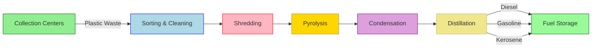

<<<<<<< HEAD
# Plastic to Fuel App

A mobile application for tracking and managing plastic waste conversion to fuel.

## Pipeline Diagram



### Process Steps

1. **Collection Centers**
   - Plastic waste collection points
   - Initial segregation of plastic types
   - Weight measurement and recording

2. **Sorting & Cleaning**
   - Separation by plastic types (PET, HDPE, LDPE, etc.)
   - Removal of contaminants
   - Washing and drying

3. **Shredding**
   - Size reduction to uniform pieces
   - Increased surface area for better processing
   - Quality control check

4. **Pyrolysis**
   - Thermal decomposition (400-450°C)
   - Absence of oxygen
   - Conversion of plastic to vapor

5. **Condensation**
   - Cooling of pyrolysis vapors
   - Conversion to liquid hydrocarbons
   - Temperature control

6. **Distillation**
   - Separation of different fuels
   - Quality refinement
   - Product classification

7. **Fuel Storage**
   - Safe storage of final products
   - Quality testing
   - Distribution preparation

## Features

- **User Authentication**
  - Login and Registration
  - Profile Management
  - Secure Session Management

- **Plastic Collection Tracking**
  - Record plastic waste collections
  - Track collection locations
  - Monitor collection statistics

- **Fuel Production Monitoring**
  - Track fuel production from plastic waste
  - Record production details
  - View production statistics

- **Dashboard**
  - Overview of collections and productions
  - Quick statistics and insights
  - Educational information

## Getting Started

### Prerequisites

- Flutter SDK (>=3.0.0)
- Dart SDK (>=3.0.0)
- Android Studio / VS Code
- Android SDK for Android deployment
- Xcode for iOS deployment (Mac only)

### Installation

1. Clone the repository:
   ```bash
   git clone https://github.com/yourusername/p2f_app.git
   ```

2. Navigate to the project directory:
   ```bash
   cd p2f_app
   ```

3. Install dependencies:
   ```bash
   flutter pub get
   ```

4. Run the app:
   ```bash
   flutter run
   ```
=======
# Plastic-to-Fuel Conversion Station

A modern web application for managing plastic waste conversion to fuel, tracking contributions, and rewarding users for their environmental impact.

## Features

- **User Dashboard**
  - Track plastic waste contributions
  - Monitor fuel credits earned
  - View recent activity
  - Check rewards points

- **Plastic Submission System**
  - Submit plastic waste details
  - Select plastic types (PET, HDPE, LDPE, PP)
  - Choose collection points
  - Automatic credit calculation

- **Rewards Program**
  - Convert plastic waste to fuel credits
  - Redeem credits for rewards
  - View available rewards
  - Track redemption history

- **Admin Dashboard**
  - Monitor system status
  - Manage plastic waste submissions
  - Track machine performance
  - Handle user approvals

## Technologies Used

- HTML5
- CSS3 (with modern Flexbox and Grid layouts)
- JavaScript (ES6+)
- Font Awesome for icons
- Google Fonts (Poppins)

## Setup

1. Clone the repository:
   ```bash
   git clone https://github.com/yourusername/plastic2fuel.git
   ```

2. Open the project:
   ```bash
   cd plastic2fuel
   ```

3. Open `index.html` in your web browser to view the application.
>>>>>>> cf4ee53a179b3a701efba1b58214fd8c069c0a69

## Project Structure

```
<<<<<<< HEAD
lib/
├── models/          # Data models
├── providers/       # State management
├── screens/         # UI screens
├── widgets/         # Reusable widgets
└── main.dart        # App entry point
```

## Dependencies

- provider: ^6.0.5 (State Management)
- http: ^0.13.5 (API Calls)
- shared_preferences: ^2.1.1 (Local Storage)
- intl: ^0.18.1 (Internationalization)
- url_launcher: ^6.1.11 (URL Handling)

=======
plastic2fuel/
├── index.html          # Main HTML file
├── styles.css          # CSS styles
├── script.js           # JavaScript functionality
└── README.md          # Project documentation
```

>>>>>>> cf4ee53a179b3a701efba1b58214fd8c069c0a69
## Contributing

1. Fork the repository
2. Create your feature branch (`git checkout -b feature/AmazingFeature`)
3. Commit your changes (`git commit -m 'Add some AmazingFeature'`)
4. Push to the branch (`git push origin feature/AmazingFeature`)
5. Open a Pull Request

## License

<<<<<<< HEAD
This project is licensed under the MIT License - see the [LICENSE](LICENSE) file for details.

## Acknowledgments

- Flutter Team for the amazing framework
- All contributors who participate in this project
=======
This project is licensed under the MIT License - see the LICENSE file for details. 
>>>>>>> cf4ee53a179b3a701efba1b58214fd8c069c0a69
